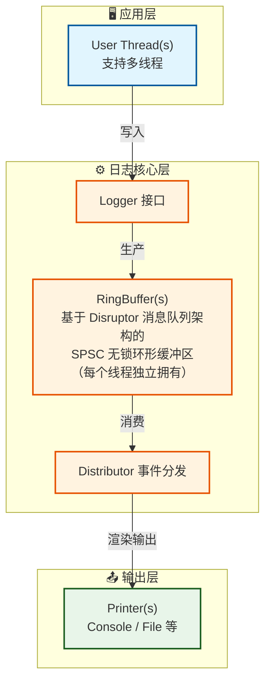
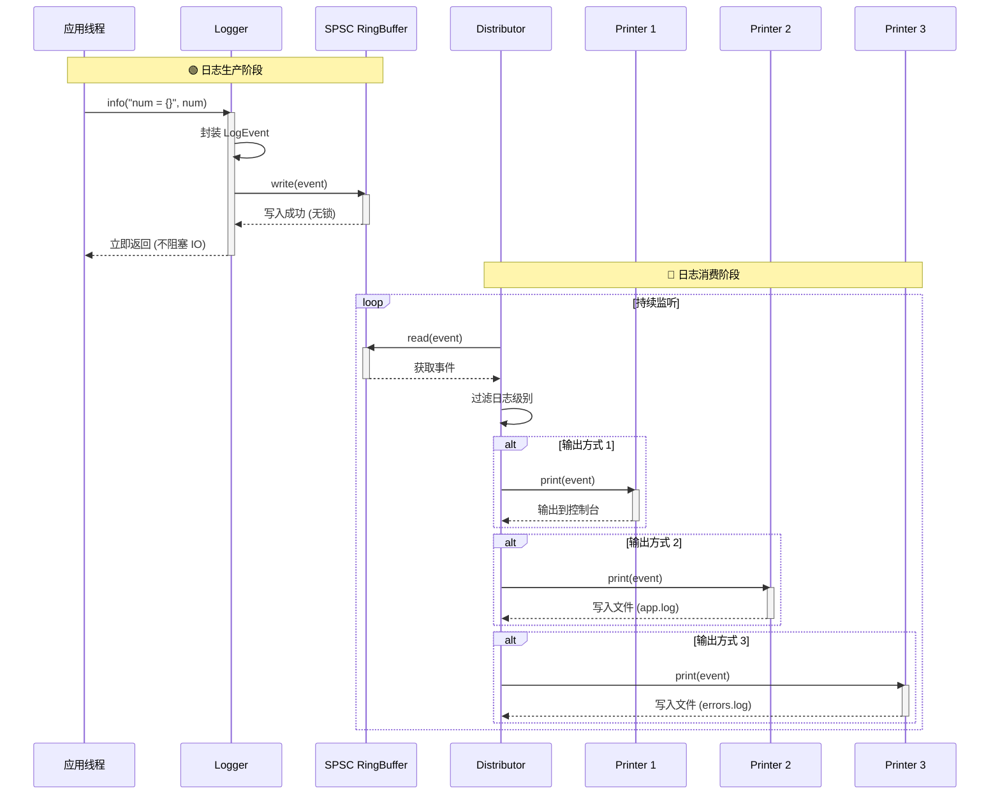

# TinyLogger 开发者文档

> 面向开发者：构建系统、测试规范、架构设计与贡献指南
> 项目开源地址：[Github: TinyLogger](https://github.com/2059353675/TinyLogger)

## 目录

- [项目结构](#项目结构)
- [构建系统](#构建系统)
  - [CMake 配置](#cmake-配置)
  - [构建命令](#构建命令)
  - [清理构建](#清理构建)
- [测试系统](#测试系统)
  - [测试架构](#测试架构)
  - [运行测试](#运行测试)
  - [编写测试](#编写测试)
  - [测试工具函数](#测试工具函数)
- [代码规范](#代码规范)
- [架构设计](#架构设计)
- [贡献指南](#贡献指南)
- [依赖管理](#依赖管理)

---

## 项目结构

```
TinyLogger/
├── CMakeLists.txt              # 主 CMake 构建文件
├── include/TinyLogger/         # 头文件
│   ├── logger.h
│   ├── ring_buffer.h
│   ├── config.h
│   ├── distributor.h
│   ├── printer.h
│   ├── types.h
│   └── ...
├── src/                        # 实现文件
│   ├── logger.cpp
│   ├── ring_buffer.cpp
│   ├── config.cpp
│   ├── distributor.cpp
│   ├── printer_console.cpp
│   ├── printer_file.cpp
│   ├── printer_null.cpp
│   └── ...
├── test/                       # 测试套件
│   ├── CMakeLists.txt          # 测试 CMake 配置
│   ├── test_common.h          # 测试框架、公共测试工具等
│   ├── test_ring_buffer.cpp   # RingBuffer 单元测试
│   ├── test_config.cpp        # Config 单元测试
│   ├── test_printer.cpp       # Printer 单元测试
│   ├── test_distributor.cpp  # Distributor 单元测试
│   └── test_logger.cpp        # Logger 集成测试
├── examples/                  # 示例程序
│   ├── example.cpp
│   └── ...
├── docs/                      # 文档
│   ├── USER_GUIDE.md          # 用户指南
│   └── DEVELOPER.md          # 开发者文档（本文件）
└── .clang-format              # 代码格式化配置
```

---

## 架构设计

### 核心组件



### 数据流

1. 用户调用 `logger.fatal("严重错误：系统崩溃，错误码：{}", errorcode);` 
2. Logger 将日志信息封装成 `LogEvent`，写入 `RingBuffer`
3. `Distributor` 线程从 `RingBuffer` 读取事件
4. `Distributor` 根据级别过滤，分发给匹配的 `Printer`
5. `Printer` 格式化日志信息，并写入目标（控制台/文件），如
    - `[2026-03-21 07:19:25.339158][8343213073192788484][Fatal] 严重错误：系统崩溃，错误码：57005`

时序图如下：


### 关键特性

- **异步日志：** 应用线程不阻塞（提交日志仅需约 30 纳秒），日志输出由 Distributor 线程分发给 Printers 处理
- **无锁缓冲区：** RingBuffer 为单生产者单消费者（SPSC）队列，无需锁，提供了良好的高并发性能
- **RAII 资源管理：** 所有资源（文件、线程）在析构时自动清理

---

## 构建系统

### CMake 配置

项目使用 CMake 3.14+ 构建，主配置文件位于 `CMakeLists.txt`。

**核心配置项：**

```cmake
# 构建选项
option(TINYLOGGER_BUILD_TESTS "Build tests" ON)
option(TINYLOGGER_BUILD_EXAMPLES "Build examples" ON)

# 依赖查找
find_path(NLOHMANN_JSON_INCLUDE_DIR NAMES nlohmann/json.hpp ...)
find_path(FMT_INCLUDE_DIR NAMES fmt/format.h ...)
find_library(FMT_LIBRARY NAMES fmt ...)
```

### 构建命令

#### 完整构建（推荐）

```bash
mkdir build && cd build
cmake .. -DCMAKE_BUILD_TYPE=Release
make
```

#### 选择性构建

```bash
# 仅构建库（不构建测试和示例）
cmake .. -DTINYLOGGER_BUILD_TESTS=OFF -DTINYLOGGER_BUILD_EXAMPLES=OFF

# 仅构建测试
cmake .. -DTINYLOGGER_BUILD_EXAMPLES=OFF

# 仅构建示例
cmake .. -DTINYLOGGER_BUILD_TESTS=OFF
```

#### 运行测试

```bash
# 方式 1：使用 make 目标
make run_tests

# 方式 2：使用 CTest
ctest --output-on-failure
```

#### 安装

```bash
make install  # 默认安装到 /usr/local

# 自定义安装路径
cmake .. -DCMAKE_INSTALL_PREFIX=/opt/tinylogger
make install
```

### 清理构建

```bash
# 标准清理（仅清理构建产物）
make clean

# 完整清理（构建产物 + 测试临时文件 + 示例产物）
make clean-all
```

`clean-all` 目标会清理：
- CMake/Make 构建产物
- 测试产生的临时文件（`test_temp_*.json`、`test_*.log`）
- 示例产生的日志文件（`examples/*.log`）

---

## 测试系统

### 测试架构

TinyLogger 使用**自定义测试框架**（不依赖外部测试库），包含 5 个测试套件：

| 测试文件 | 测试类型 | 测试数量 | 覆盖模块 |
|---------|---------|---------|---------|
| `test_ring_buffer.cpp` | 单元测试 | 11 | 环形缓冲区 |
| `test_printer.cpp` | 单元测试 | 13 | Console/File Printer |
| `test_distributor.cpp` | 单元测试 | 13 | 事件分发器 |
| `test_logger.cpp` | 集成测试 | 14 | Logger 完整流程 |

**总计：51 个测试用例**

### 运行测试

#### 使用主构建系统

```bash
cd build
make run_tests
```

#### 使用测试脚本

```bash
# Linux/macOS
cd test
chmod +x run_tests.sh
./run_tests.sh

# Windows
cd test
run_tests.bat
```

**注意：** 测试脚本是轻量包装，需要先执行主构建。

#### 运行单个测试

```bash
cd build/test
./test_ring_buffer
./test_printer
./test_distributor
./test_logger
```

### 编写测试

#### 测试文件结构

每个测试文件遵循以下结构：

```cpp
#include <TinyLogger/xxx.h>
#include "test_common.h"

using namespace TinyLogger;
using namespace TinyLogger::test;

// ==================== 测试函数 ====================

bool test_xxx_feature() {
    // 测试逻辑
    return true; // 通过
    // return false; // 失败
}

// ==================== 主函数 ====================

int main() {
    std::cout << "========================================" << std::endl;
    std::cout << "  XXX Test Suite" << std::endl;
    std::cout << "========================================" << std::endl;

    TestResult result;

    run_test("Feature 1", test_xxx_feature_1, result);
    run_test("Feature 2", test_xxx_feature_2, result);
    
    print_test_summary("XXX Test Suite", result);
    return result.failed > 0 ? 1 : 0;
}
```

#### 测试函数规范

**要求：**
1. 测试函数返回 `bool`（`true` = 通过，`false` = 失败）
2. **不在测试函数内打印 `[TEST]` 或 `PASSED/FAILED`**（由框架统一处理）
3. 使用 `test_common.h` 提供的工具函数
4. 临时文件使用 RAII 类（自动清理）

**推荐：**
- 测试函数命名：`test_模块_功能`，如 `test_ring_buffer_creation`
- 使用简洁的断言逻辑，直接返回布尔表达式
- 并发测试使用适当的等待和同步机制

### 测试工具函数

`test/test_common.h` 提供以下工具：

#### `create_test_event()`

创建测试用 `LogEvent`：

```cpp
// 版本 1：返回 LogEvent（适用于 distributor、printer 测试）
LogEvent event = create_test_event(LogLevel::Info, "Test message");

// 版本 2：通过引用赋值，返回 bool（适用于 ring_buffer 测试）
LogEvent event;
bool ok = create_test_event(event, LogLevel::Info, "Test message");
```

#### `TempLogFile` - 临时日志文件

RAII 风格，提供内容读取：

```cpp
{
    TempLogFile log("output.log");
    
    // 使用 log.path() 作为日志输出路径
    Logger logger;
    logger.init(create_file_config(log.path()));
    logger.info("Test");
    logger.shutdown();
    
    // 读取内容验证
    std::string content = log.read_content();
    assert(content.find("Test") != std::string::npos);
} // 文件自动删除
```

#### `run_test()` - 测试运行器

统一执行、捕获异常、统计结果：

```cpp
TestResult result;
run_test("Test name", test_function, result);
```

#### `print_test_summary()` - 结果输出

打印格式化的测试结果：

```cpp
print_test_summary("Suite Name", result);
// 输出：
// ========================================
//   Suite Name
//   Results: 10 passed, 0 failed
// ========================================
```

---

## 代码规范

### 命名约定

| 类型 | 规范 | 示例 |
|------|------|------|
| 类名 | PascalCase | `RingBuffer`, `ConsolePrinter` |
| 函数/方法 | snake_case | `create_test_event`, `should_log` |
| 变量 | snake_case | `buffer_size`, `min_level` |
| 常量 | UPPER_SNAKE_CASE | `LOG_MSG_SIZE`, `MAX_PRINTERS` |
| 命名空间 | snake_case | `tiny_logger`, `tiny_logger::test` |

### 代码风格

- **换行、空格等：** 由 `.clang-format` 自动配置
- **枚举类型的简单判断：** 优先用 `switch` 结构
- **头文件保护：** `#pragma once` 风格
- **注释：** 中文，Doxygen 风格；关键逻辑必须注释

### 提交规范

提交消息格式：

```
<type>: <subject>

<body>  # 可选
```

**Type 列表：**
- `feat`：新功能
- `fix`：修复 bug
- `docs`：文档更新
- `refactor`：代码重构
- `test`：测试相关
- `chore`：构建/工具链变更

---

## 未来计划

字母越前，重要性越高，即 A 最优先，以此类推。

### 更好的配置方式（B）

### 增加串口打印（C）

支持 RS-232、RS-485/RS-422、UART 等串口通信方式

### 自定义日志输出格式化（D）

目前，每个 printer 的格式化方法都被硬编码进 `printer_xxx.h`，未来可以支持在配置文件中增加可选的自定义 pattern（类似 spdlog %Y-%m-%d [%l] %v）

### 依赖管理（D）

计划支持以下包管理器：

- **vcpkg：** 添加 `vcpkg.json`
- **Conan：** 添加 `conanfile.txt`
- **FetchContent：** CMake 自动下载
