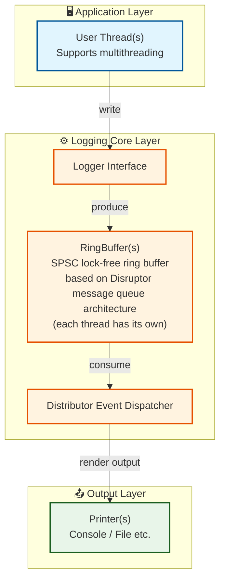
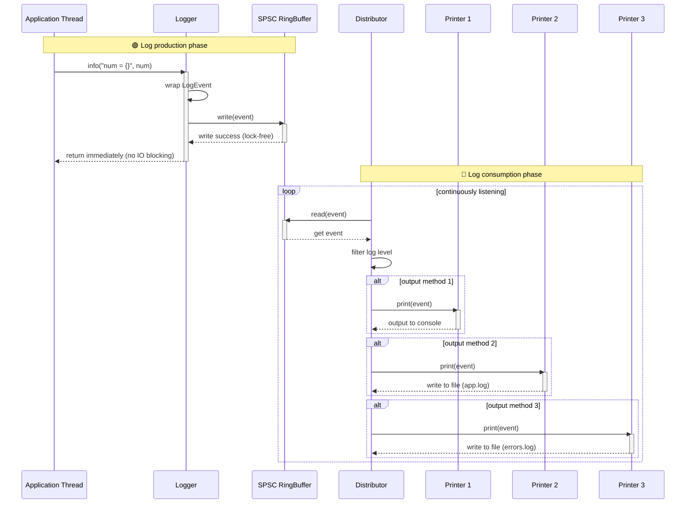

# TinyLogger Developer Documentation

**[English](./DEVELOPER.md)** | **[简体中文](./DEVELOPER.zh-Hans.md)** | **[繁體中文](./DEVELOPER.zh-Hant.md)**

> For developers: Build system, testing standards, architecture design, and contribution guide
> Project open source address: [Github: TinyLogger](https://github.com/2059353675/TinyLogger)

## Table of Contents

- [Project Structure](#project-structure)
- [Architecture Design](#architecture-design)
- [Build System](#build-system)
    - [CMake Configuration](#cmake-configuration)
    - [Build Commands](#build-commands)
    - [Cleaning the Build](#cleaning-the-build)
- [Testing System](#testing-system)
    - [Testing Architecture](#testing-architecture)
    - [Running Tests](#running-tests)
    - [Writing Tests](#writing-tests)
    - [Test Utility Functions](#test-utility-functions)
- [Contribution Guide](#contribution-guide)
- [Future Plans](#future-plans)

---

## Project Structure

```
TinyLogger/
├── CMakeLists.txt              # Main CMake build file
├── include/tiny_logger/        # Header files
│   ├── logger.hpp
│   ├── logger_builder.hpp
│   ├── logger_factory.hpp
│   ├── logger_error.hpp
│   ├── ring_buffer.hpp
│   ├── distributor.hpp
│   ├── printer.hpp
│   ├── printer/
│   │   ├── base.hpp
│   │   ├── console.hpp
│   │   ├── file.hpp
│   │   └── null.hpp
│   ├── types.hpp
│   ├── thread_name.hpp
│   └── ...
├── src/                        # Implementation files
│   ├── logger.cpp
│   ├── logger_builder.cpp
│   ├── logger_factory.cpp
│   ├── ring_buffer.cpp
│   ├── distributor.cpp
│   ├── queue_registry.cpp
│   ├── console.cpp
│   ├── file.cpp
│   ├── null.cpp
│   └── ...
├── test/                       # Test suite
│   ├── CMakeLists.txt
│   ├── test_common.hpp
│   ├── test_ring_buffer.cpp
│   ├── test_printer.cpp
│   ├── test_distributor.cpp
│   └── test_logger.cpp
├── examples/                   # Example programs
│   ├── example.cpp
│   └── speed_test.cpp
├── docs/                       # Documentation
│   ├── USER_GUIDE.md          # User guide
│   └── DEVELOPER.md           # Developer documentation (this file)
└── .clang-format               # Code formatting configuration
```

---

## Architecture Design

### Core Components


```mermaid
flowchart TD
    classDef appLayer fill:#e1f5fe,stroke:#01579b,stroke-width:2px;
    classDef coreLayer fill:#fff3e0,stroke:#e65100,stroke-width:2px;
    classDef outLayer fill:#e8f5e9,stroke:#1b5e20,stroke-width:2px;
    classDef note fill:#f5f5f5,stroke:#9e9e9e,stroke-dasharray: 5 5,font-size:12px;

    subgraph App ["🖥️ Application Layer"]
        direction TB
        User["User Thread(s)<br/>Supports multithreading"]:::appLayer
    end

    subgraph Core ["⚙️ Logging Core Layer"]
        direction TB
        Logger["Logger Interface"]:::coreLayer
        Ring["RingBuffer(s)<br/>SPSC lock-free ring buffer<br/>based on Disruptor message queue architecture<br/>(each thread has its own)"]:::coreLayer
        Dist["Distributor Event Dispatcher"]:::coreLayer
    end

    subgraph Out ["📤 Output Layer"]
        direction TB
        Printer["Printer(s)<br/>Console / File etc."]:::outLayer
    end

    User -->|write | Logger
    Logger -->|produce | Ring
    Ring -->|consume | Dist
    Dist -->|render output | Printer
```

### Data Flow

1. User calls `logger.fatal("Fatal error: system crash, error code: {}", errorcode);`
2. Logger wraps the log information into a `LogEvent` and writes it to `RingBuffer`
3. `Distributor` thread reads events from `RingBuffer`
4. `Distributor` filters by level and dispatches to matching `Printer`s
5. `Printer` formats the log message and writes to target (console/file), e.g.,
    - `[2026-03-21 07:19:25.339158][8343213073192788484][Fatal] Fatal error: system crash, error code: 57005`

### Distributor Wake-Up Protocol

The Distributor's idle wait is dispatched on `WaitStrategy` (`BusySpin` / `Yield` / `Sleep` / `Blocking`, default `Blocking`).
User-facing selection guidance lives in the README; this section documents the `Blocking` implementation.

**Edge-triggered notification (producer side):**
- `RingBuffer::enqueue()` returns `EnqueueResult`: `Full` on overflow, `Success_EmptyToNonEmpty` when the queue transitioned empty → non-empty, `Success_NonEmptyToNonEmpty` otherwise.
- `Logger::log()` calls `Distributor::notify_work()` **only** on `Success_EmptyToNonEmpty` — the common sustained-logging path (queue already non-empty) performs **zero** extra work.
- `notify_work()` bumps a monotonic `generation_` counter (release) and signals the condition variable.

**Blocking wait (consumer side):**
- The idle path captures `generation_` (acquire), refreshes the queue snapshot, re-checks for work, then blocks on `wake_cv_.wait(predicate)` where the predicate is `generation_ != local || !running_`.
- The predicate makes lost/redundant wakeups impossible: any producer bump observed before the wait is caught by the predicate; any bump after capture is caught by the post-capture snapshot refresh + re-check.
- The snapshot is refreshed **after** capturing the generation (not before): because `register_queue()` happens-before the producer's enqueue, which happens-before the visible bump, a post-capture snapshot is guaranteed to contain the queue of any observed enqueue. This closes the race where a queue registered mid-processing could strand its events.
- `stop()` sets `running_ = false`, calls `notify_work()`, joins the worker (which then drains), and flushes.

**Low-level contract:** directly enqueuing into a `RingBuffer` (bypassing `Logger`) does **not** notify the Distributor. Under `Blocking`, callers must invoke `Distributor::notify_work()` after an empty→non-empty enqueue, or events can stall. The high-level `Logger` does this automatically.

### Performance Test Results

Measured on an x86_64 host (`-O3 -march=native`, TSC ≈ 1.87 cycles/ns) while developing the `WaitStrategy` feature. Idle CPU was measured by idling a single-core-pinned process for 5 s (`taskset -c 0`); latency/throughput used the `benchmark` example and a dedicated producer-side micro-benchmark.

**Idle CPU (single core, 5 s idle):**

| Strategy   | Idle CPU | run() loop iterations (2 s) |
|------------|----------|-----------------------------|
| `Blocking` | 0%       | ≈ 1 (blocks, no notify → no iteration) |
| `Sleep`    | ≈ 1%     | ~2000 (1 ms interval)       |
| `Yield`    | ≈ 93%    | > 1000 (busy)               |
| `BusySpin` | ≈ 93%    | busy                        |

**Producer-side `logger.info()` latency (cycles; p50 identical across strategies):**

| Strategy   | p50 | p99 (single core) | p99 (multicore) |
|------------|-----|-------------------|-----------------|
| `Blocking` | ~67 | ~6900 (≈ 3.7 µs futex wake on idle→active, once per burst) | ~83 |
| `Yield`    | ~68 | ~78               | ~136            |
| `Sleep`    | ~68 | ~84               | ~110            |
| `BusySpin` | ~68 | ~76               | ~377            |

The fast path (p50 ≈ 67 cycles ≈ 36 ns) is unchanged across all strategies. `Blocking`'s p99 spike is a single futex wake syscall paid by the first enqueue of each idle→active burst; it disappears under sustained load / multicore.

**Throughput (producer-side enqueue attempts, ops/s):**

| Strategy   | 1 thread (single core) | 8 threads (single core) | 1 thread (multicore) | 8 threads (multicore) |
|------------|------------------------|-------------------------|----------------------|-----------------------|
| `Blocking` | 11.4M                  | 22.2M                   | 22.7M                | 37.3M                 |
| `Yield`    | 16.2M                  | 22.8M                   | 12.7M                | 37.2M                 |
| `Sleep`    | 26.4M                  | 25.5M                   | 25.4M                | 42.5M                 |
| `BusySpin` | 10.8M                  | 21.6M                   | 8.2M                 | 38.0M                 |

**Delivered (non-dropped) rate under saturation (single core, 1 producer, 200 K events, `Discard`):**
`Blocking` delivers ~2% (~1.6–2× more than `Yield`'s ~1%): a woken consumer is more efficient than a busy-yielding one that steals CPU. High drop rates under saturation are inherent to `Discard` (a formatting consumer is ~20× slower per event than a trivial-string producer on one core) and are not a regression.

**Before/after (single core, old busy-poll `Yield` vs new default `Blocking`):**

| Metric                    | Old (busy-poll Yield) | New (Blocking) |
|---------------------------|-----------------------|----------------|
| `logger.info()` avg       | 123 cycles            | 67 cycles      |
| `logger.info()` p50       | ~66 cycles            | ~67 cycles     |
| `logger.info()` p99       | ~74 cycles            | ~6900 (idle→active wakeup only) |
| Idle CPU                  | ~93%                  | 0%             |
| `RingBuffer::enqueue`     | ~4.4 cycles           | ~3.8 cycles    |

Conclusion: the `Blocking` default reduces single-core idle CPU from ~93% to 0% while *improving* average latency; the only cost is a ~3.7 µs futex wakeup on the first enqueue of each idle→active burst (absent on multicore / sustained load). If that spike is unacceptable, use `Sleep` (≈1% idle CPU, no wakeup syscall, adds ≤ `sleep_interval` latency).

Sequence diagram:


```mermaid
sequenceDiagram
    participant App as Application Thread
    participant Logger as Logger
    participant Ring as SPSC RingBuffer
    participant Dist as Distributor
    participant P1 as Printer 1
    participant P2 as Printer 2
    participant P3 as Printer 3

    Note over App, Ring: 🟢 Log production phase
    App->>Logger: info("num = {}", num);
    activate Logger
    Logger->>Logger: wrap LogEvent
    Logger->>Ring: write(event)
    activate Ring
    Ring-->>Logger: write success (lock-free)
    deactivate Ring
    Logger-->>App: return immediately (no IO blocking)
    deactivate Logger

    Note over Dist, P3: 🔵 Log consumption phase
    loop continuously listening
        Dist->>Ring: read(event)
        activate Ring
        Ring-->>Dist: get event
        deactivate Ring
        
        Dist->>Dist: filter log level
        alt output method 1
            Dist->>P1: print(event)
            activate P1
            P1-->>Dist: output to console
            deactivate P1
        end
        alt output method 2
            Dist->>P2: print(event)
            activate P2
            P2-->>Dist: write to file (app.log)
            deactivate P2
        end
        alt output method 3
            Dist->>P3: print(event)
            activate P3
            P3-->>Dist: write to file (errors.log)
            deactivate P3
        end
    end
```

### Key Features

- **Asynchronous logging:** Application threads do not block (log submission takes about 30 nanoseconds); log output is
  handled by the Distributor thread dispatching to Printers
- **Lock-free buffer:** RingBuffer is a single-producer single-consumer (SPSC) queue, no locks needed, providing
  excellent high-concurrency performance
- **RAII resource management:** All resources (files, threads) are automatically cleaned up upon destruction
- **Runtime read-only:** Logger enters an immutable state after init; all configuration (buffer_size, overflow_policy)
  cannot be changed
- **Non-copyable objects:** Logger禁止copy/move to avoid thread + queue lifetime issues
- **LoggerRef wrapper class:** Automatically manages lifetime; simplifies logging API; supports copy sharing of
  underlying Logger; provides null safety

---

## Build System

### CMake Configuration

The project uses CMake 3.14+ for building. The main configuration file is `CMakeLists.txt`.

**Core configuration options:**

```cmake
# Build options
option(TINYLOGGER_BUILD_TESTS "Build tests" ON)
option(TINYLOGGER_BUILD_EXAMPLES "Build examples" ON)

# Find dependencies
find_path(FMT_INCLUDE_DIR NAMES fmt/format.h ...)
find_library(FMT_LIBRARY NAMES fmt ...)
```

### Build Commands

#### Full Build (Recommended)

```bash
cmake -B build -DCMAKE_BUILD_TYPE=Release
cmake --build build
```

#### Selective Build

```bash
# Build only the library (skip tests and examples)
cmake .. -DTINYLOGGER_BUILD_TESTS=OFF -DTINYLOGGER_BUILD_EXAMPLES=OFF

# Build only tests
cmake .. -DTINYLOGGER_BUILD_EXAMPLES=OFF

# Build only examples
cmake .. -DTINYLOGGER_BUILD_TESTS=OFF
```

#### Running Tests

```bash
# Method 1: Using cmake target
cmake --build build --target run_tests

# Method 2: Using CTest
ctest --output-on-failure
```

#### Installation

```bash
cmake --install build  # Installs to /usr/local by default

# Custom installation path
cmake -B build -DCMAKE_INSTALL_PREFIX=/opt/tinylogger
cmake --install build
```

### Cleaning the Build

```bash
# Standard clean (only build artifacts)
cmake --build build --target clean

# Full clean (build artifacts + test temporary files + example artifacts)
cmake --build build --target clean-all
```

The `clean-all` target cleans:

- CMake/Make build artifacts
- Temporary files generated by tests (`test_temp_*.json`, `test_*.log`)
- Log files generated by examples (`examples/*.log`)

---

## Testing System

### Testing Architecture

TinyLogger uses a **custom test framework** (no external test library dependency) and includes 5 test suites:

| Test File              | Test Type         | Number of Tests | Modules Covered          |
|------------------------|-------------------|-----------------|--------------------------|
| `test_ring_buffer.cpp` | Unit tests        | 11              | Ring buffer              |
| `test_printer.cpp`     | Unit tests        | 13              | Console/File Printer     |
| `test_distributor.cpp` | Unit tests        | 13              | Event dispatcher         |
| `test_logger.cpp`      | Integration tests | 11              | Complete Logger workflow |

**Total: 51 test cases**

### Running Tests

```bash
cd build
ctest --output-on-failure
```

### Writing Tests

#### Test File Structure

Each test file follows this structure:

```cpp
#include <tiny_logger/xxx.hpp>
#include "test_common.hpp"

using namespace tiny_logger;
using namespace tiny_logger::test;

// ==================== Test functions ====================

bool test_xxx_feature() {
    // Test logic
    return true; // Pass
    // return false; // Fail
}

// ==================== Main function ====================

int main() {
    std::cout << "========================================" << std::endl;
    std::cout << "  XXX Test Suite" << std::endl;
    std::cout << "========================================" << std::endl;

    TestResult result;

    run_test("Feature 1", test_xxx_feature_1, result);
    run_test("Feature 2", test_xxx_feature_2, result);
    
    print_test_summary("XXX Test Suite", result);
    return result.failed > 0 ? 1 : 0;
}
```

#### Test Function Specifications

**Requirements:**

1. Test functions return `bool` (`true` = pass, `false` = fail)
2. **Do not print `[TEST]` or `PASSED/FAILED` inside test functions** (handled by framework)
3. Use utility functions provided by `test_common.hpp`
4. Use RAII classes for temporary files (automatic cleanup)

**Recommendations:**

- Name test functions as `test_module_feature`, e.g., `test_ring_buffer_creation`
- Use simple assertion logic, returning boolean expressions directly
- Use appropriate等待and synchronization mechanisms for concurrent tests

### Test Utility Functions

`test/test_common.hpp` provides the following utilities:

#### `create_test_event()`

Creates a `LogEvent` for testing:

```cpp
// Version 1: Returns LogEvent (suitable for distributor, printer tests)
LogEvent event = create_test_event(LogLevel::Info, "Test message");

// Version 2: Assigns by reference, returns bool (suitable for ring_buffer tests)
LogEvent event;
bool ok = create_test_event(event, LogLevel::Info, "Test message");
```

#### `TempLogFile` - Temporary Log File

RAII style for temporary files with content reading:

```cpp
{
    TempLogFile log("output.log");
    
    // Use log.path() as the log output path
    Logger logger;
    logger.init(create_file_config(log.path()));
    logger.info("Test");
    
    // Read content to verify
    std::string content = log.read_content();
    assert(content.find("Test") != std::string::npos);
} // File automatically deleted
```

#### `run_test()` - Test Runner

统一执行、捕获异常、统计结果：

```cpp
TestResult result;
run_test("Test name", test_function, result);
```

#### `print_test_summary()` - Result Output

Prints formatted test results:

```cpp
print_test_summary("Suite Name", result);
// Output:
// ========================================
//   Suite Name
//   Results: 10 passed, 0 failed
// ========================================
```

---

## Contribution Guide

### Naming Conventions

| Type              | Convention       | Example                            |
|-------------------|------------------|------------------------------------|
| Class names       | PascalCase       | `RingBuffer`, `ConsolePrinter`     |
| Functions/methods | snake_case       | `create_test_event`, `should_log`  |
| Variables         | snake_case       | `buffer_size`, `min_level`         |
| Constants         | UPPER_SNAKE_CASE | `LOG_MSG_SIZE`, `MAX_PRINTERS`     |
| Namespaces        | snake_case       | `tiny_logger`, `tiny_logger::test` |

### Code Style

- **Line breaks, whitespace, etc.:** Automatically configured by `.clang-format`
- **Header guards:** `#pragma once` style
- **Comments:** Doxygen style;关键逻辑必须注释

### Commit Specifications

Commit message format:

```
<type>: <subject>

<body>  # Optional
```

**Type list:**

- `feat`: New feature
- `fix`: Bug fix
- `docs`: Documentation update
- `refactor`: Code refactoring
- `test`: Test-related
- `chore`: Build/toolchain changes

---

## Future Plans

The earlier the letter, the higher the priority, i.e., A is highest priority, and so on.

### Add Serial Port Printing (C)

Support RS-232, RS-485/RS-422, UART and other serial communication methods.

### Custom Log Output Formatting (D)

Currently, the formatting method for each printer is hardcoded into `printer_xxx.hpp`. In the future, support can be added
for optional custom patterns in the configuration file (similar to spdlog's `%Y-%m-%d [%l] %v`).

### Dependency Management (D)

Plans to support the following package managers:

- **vcpkg:** Add `vcpkg.json`
- **Conan:** Add `conanfile.txt`