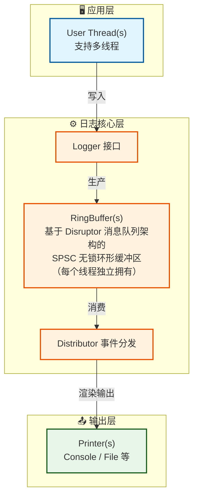
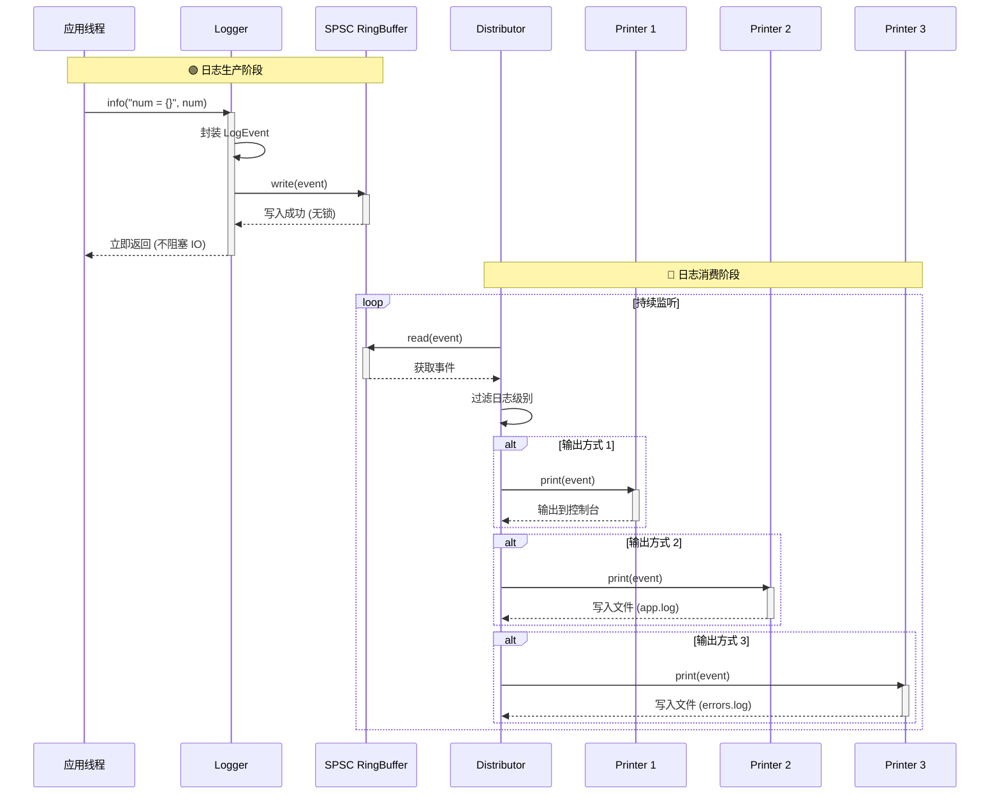

# TinyLogger 开发者文档

**[English](./DEVELOPER.md)** | **[简体中文](./DEVELOPER.zh-Hans.md)** | **[繁體中文](./DEVELOPER.zh-Hant.md)**

> 面向开发者：构建系统、测试规范、架构设计与贡献指南
> 项目开源地址：[Github: TinyLogger](https://github.com/2059353675/TinyLogger)

## 目录

- [项目结构](#项目结构)
- [架构设计](#架构设计)
- [构建系统](#构建系统)
    - [CMake 配置](#cmake-配置)
    - [构建命令](#构建命令)
    - [清理构建](#清理构建)
- [测试系统](#测试系统)
    - [测试架构](#测试架构)
    - [运行测试](#运行测试)
    - [编写测试](#编写测试)
    - [测试工具函数](#测试工具函数)
- [贡献指南](#贡献指南)
- [未来计划](#未来计划)

---

## 项目结构

```
TinyLogger/
├── CMakeLists.txt              # 主 CMake 构建文件
├── include/tiny_logger/        # 头文件
│   ├── logger.hpp
│   ├── logger_builder.hpp
│   ├── logger_factory.hpp
│   ├── logger_error.hpp
│   ├── ring_buffer.hpp
│   ├── distributor.hpp
│   ├── printer.hpp
│   ├── printer/
│   │   ├── base.hpp
│   │   ├── console.hpp
│   │   ├── file.hpp
│   │   └── null.hpp
│   ├── types.hpp
│   ├── thread_name.hpp
│   └── ...
├── src/                        # 实现文件
│   ├── logger.cpp
│   ├── logger_builder.cpp
│   ├── logger_factory.cpp
│   ├── ring_buffer.cpp
│   ├── distributor.cpp
│   ├── queue_registry.cpp
│   ├── console.cpp
│   ├── file.cpp
│   ├── null.cpp
│   └── ...
├── test/                       # 测试套件
│   ├── CMakeLists.txt
│   ├── test_common.hpp
│   ├── test_ring_buffer.cpp
│   ├── test_printer.cpp
│   ├── test_distributor.cpp
│   └── test_logger.cpp
├── examples/                  # 示例程序
│   ├── example.cpp
│   └── speed_test.cpp
├── docs/                      # 文档
│   ├── USER_GUIDE.md          # 用户指南
│   └── DEVELOPER.md          # 开发者文档（本文件）
└── .clang-format              # 代码格式化配置
```

---

## 架构设计

### 核心组件



### 数据流

1. 用户调用 `logger.fatal("严重错误：系统崩溃，错误码：{}", errorcode);`
2. Logger 将日志信息封装成 `LogEvent`，写入 `RingBuffer`
3. `Distributor` 线程从 `RingBuffer` 读取事件
4. `Distributor` 根据级别过滤，分发给匹配的 `Printer`
5. `Printer` 格式化日志信息，并写入目标（控制台/文件），如
    - `[2026-03-21 07:19:25.339158][8343213073192788484][Fatal] 严重错误：系统崩溃，错误码：57005`

时序图如下：



### Distributor 唤醒协议

Distributor 空闲等待按 `WaitStrategy`（`BusySpin` / `Yield` / `Sleep` / `Blocking`，默认 `Blocking`）分发。
面向用户的策略选择指南在 README 中；本节记录 `Blocking` 的实现细节。

**边沿触发通知（生产者侧）：**
- `RingBuffer::enqueue()` 返回 `EnqueueResult`：溢出时 `Full`；队列由空转为非空时 `Success_EmptyToNonEmpty`；其余为 `Success_NonEmptyToNonEmpty`。
- `Logger::log()` **仅在** `Success_EmptyToNonEmpty` 时调用 `Distributor::notify_work()`——持续日志的常见路径（队列本就非空）**零额外开销**。
- `notify_work()` 使单调递增的 `generation_` 计数器自增（release）并唤醒条件变量。

**阻塞等待（消费者侧）：**
- 空闲路径先捕获 `generation_`（acquire），刷新队列快照，复查是否有工作，然后阻塞在 `wake_cv_.wait(predicate)` 上，谓词为 `generation_ != local || !running_`。
- 该谓词使丢失/重复唤醒不可能发生：等待前被观察到的任何生产者 bump 都会被谓词捕获；捕获后的 bump 则由"捕获后刷新快照 + 复查"兜住。
- 快照在**捕获代数之后**（而非之前）刷新：因为 `register_queue()` 先于生产者的 `enqueue`，而 `enqueue` 又先于可见的 bump，所以捕获后的快照必然包含任何被观察入队所属的队列。这闭合了"处理中途注册新队列导致事件滞留"的竞态。
- `stop()` 将 `running_` 置为 `false`，调用 `notify_work()`，join 工作线程（随后 drain），最后 flush。

**底层契约：** 绕过 `Logger` 直接向 `RingBuffer` `enqueue` 不会通知 Distributor。在 `Blocking` 下，调用者必须在"空→非空"入队后自行调用 `Distributor::notify_work()`，否则事件会滞留。高层 `Logger` 会自动完成此操作。

### 性能测试结果

在 x86_64 主机上测量（`-O3 -march=native`，TSC ≈ 1.87 cycles/ns），开发 `WaitStrategy` 功能时记录。空闲 CPU 通过单核固定（`taskset -c 0`）空闲 5 秒测量；延迟/吞吐使用 `benchmark` 示例与专用的生产者侧微基准。

**空闲 CPU（单核，空闲 5 秒）：**

| 策略       | 空闲 CPU | run() 循环次数（2 秒） |
|------------|----------|------------------------|
| `Blocking` | 0%       | ≈ 1（阻塞，无 notify 即不迭代） |
| `Sleep`    | ≈ 1%     | ~2000（1ms 间隔）      |
| `Yield`    | ≈ 93%    | > 1000（忙轮询）       |
| `BusySpin` | ≈ 93%    | 忙转                   |

**生产者侧 `logger.info()` 延迟（cycles；p50 各策略一致）：**

| 策略       | p50 | p99（单核） | p99（多核） |
|------------|-----|------------|------------|
| `Blocking` | ~67 | ~6900（≈3.7µs futex 唤醒，仅空闲→活跃时每次突发一次） | ~83 |
| `Yield`    | ~68 | ~78        | ~136       |
| `Sleep`    | ~68 | ~84        | ~110       |
| `BusySpin` | ~68 | ~76        | ~377       |

快速路径（p50 ≈ 67 cycles ≈ 36ns）在四种策略下完全一致。`Blocking` 的 p99 尖峰是空闲→活跃时每次突发第一次入队付出的一次 futex 唤醒系统调用；在持续负载/多核下不出现。

**吞吐（生产者侧入队尝试，ops/s）：**

| 策略       | 1线程(单核) | 8线程(单核) | 1线程(多核) | 8线程(多核) |
|------------|------------|------------|------------|------------|
| `Blocking` | 11.4M      | 22.2M      | 22.7M      | 37.3M      |
| `Yield`    | 16.2M      | 22.8M      | 12.7M      | 37.2M      |
| `Sleep`    | 26.4M      | 25.5M      | 25.4M      | 42.5M      |
| `BusySpin` | 10.8M      | 21.6M      | 8.2M       | 38.0M      |

**饱和交付率（单核，1 生产者，20 万条，`Discard`）：**
`Blocking` 实际送达约 2%（约为 `Yield` 的 ~1% 的 1.6–2 倍）：被高效唤醒的消费者比忙轮询抢 CPU 的消费者更高效。饱和下的高丢弃率是 `Discard` 的固有现象（单核上格式化消费者单条处理比简单字符串生产者慢约 20 倍），并非本次改动引入。

**改动前后对比（单核，旧忙轮询 `Yield` vs 新默认 `Blocking`）：**

| 指标                 | 旧（busy-poll Yield） | 新（Blocking） |
|----------------------|----------------------|----------------|
| `logger.info()` avg  | 123 cycles           | 67 cycles      |
| `logger.info()` p50  | ~66 cycles           | ~67 cycles     |
| `logger.info()` p99  | ~74 cycles           | ~6900（仅空闲→活跃唤醒） |
| 空闲 CPU             | ~93%                 | 0%             |
| `RingBuffer::enqueue` | ~4.4 cycles          | ~3.8 cycles    |

结论：`Blocking` 默认值将单核空闲 CPU 从 ~93% 降到 0%，且平均延迟反而改善；唯一代价是每次空闲→活跃突发的首次入队多一次 ~3.7µs 的 futex 唤醒（多核/持续负载下不存在）。若该尖峰不可接受，可改用 `Sleep`（≈1% 空闲 CPU、无唤醒系统调用，代价是 ≤ `sleep_interval` 的延迟）。

### 关键特性

- **异步日志：** 应用线程不阻塞（提交日志仅需约 30 纳秒），日志输出由 Distributor 线程分发给 Printers 处理
- **无锁缓冲区：** RingBuffer 为单生产者单消费者（SPSC）队列，无需锁，提供了良好的高并发性能
- **RAII 资源管理：** 所有资源（文件、线程）在析构时自动清理
- **运行期只读：** Logger 在 init 后进入不可变状态，所有配置（buffer_size、overflow_policy）不可更改
- **对象不可拷贝：** Logger 禁止拷贝/移动，避免线程 + 队列生命周期问题
- **LoggerRef 包装类：** 自动管理生命周期；简化日志 API；支持拷贝共享底层 Logger；提供空安全

---

## 构建系统

### CMake 配置

项目使用 CMake 3.14+ 构建，主配置文件位于 `CMakeLists.txt`。

**核心配置项：**

```cmake
# 构建选项
option(TINYLOGGER_BUILD_TESTS "Build tests" ON)
option(TINYLOGGER_BUILD_EXAMPLES "Build examples" ON)

# 依赖查找
find_path(FMT_INCLUDE_DIR NAMES fmt/format.h ...)
find_library(FMT_LIBRARY NAMES fmt ...)
```

### 构建命令

#### 完整构建（推荐）

```bash
cmake -B build -DCMAKE_BUILD_TYPE=Release
cmake --build build
```

#### 选择性构建

```bash
# 仅构建库（不构建测试和示例）
cmake .. -DTINYLOGGER_BUILD_TESTS=OFF -DTINYLOGGER_BUILD_EXAMPLES=OFF

# 仅构建测试
cmake .. -DTINYLOGGER_BUILD_EXAMPLES=OFF

# 仅构建示例
cmake .. -DTINYLOGGER_BUILD_TESTS=OFF
```

#### 运行测试

```bash
# 方式 1：使用 cmake 目标
cmake --build build --target run_tests

# 方式 2：使用 CTest
ctest --output-on-failure
```

#### 安装

```bash
cmake --install build  # 默认安装到 /usr/local

# 自定义安装路径
cmake -B build -DCMAKE_INSTALL_PREFIX=/opt/tinylogger
cmake --install build
```

### 清理构建

```bash
# 标准清理（仅清理构建产物）
cmake --build build --target clean

# 完整清理（构建产物 + 测试临时文件 + 示例产物）
cmake --build build --target clean-all
```

`clean-all` 目标会清理：

- CMake/Make 构建产物
- 测试产生的临时文件（`test_temp_*.json`、`test_*.log`）
- 示例产生的日志文件（`examples/*.log`）

---

## 测试系统

### 测试架构

TinyLogger 使用**自定义测试框架**（不依赖外部测试库），包含 5 个测试套件：

| 测试文件                   | 测试类型 | 测试数量 | 覆盖模块                 |
|------------------------|------|------|----------------------|
| `test_ring_buffer.cpp` | 单元测试 | 11   | 环形缓冲区                |
| `test_printer.cpp`     | 单元测试 | 13   | Console/File Printer |
| `test_distributor.cpp` | 单元测试 | 13   | 事件分发器                |
| `test_logger.cpp`      | 集成测试 | 11   | Logger 完整流程          |

**总计：51 个测试用例**

### 运行测试

```bash
cd build
ctest --output-on-failure
```

### 编写测试

#### 测试文件结构

每个测试文件遵循以下结构：

```cpp
#include <tiny_logger/xxx.hpp>
#include "test_common.hpp"

using namespace tiny_logger;
using namespace tiny_logger::test;

// ==================== 测试函数 ====================

bool test_xxx_feature() {
    // 测试逻辑
    return true; // 通过
    // return false; // 失败
}

// ==================== 主函数 ====================

int main() {
    std::cout << "========================================" << std::endl;
    std::cout << "  XXX Test Suite" << std::endl;
    std::cout << "========================================" << std::endl;

    TestResult result;

    run_test("Feature 1", test_xxx_feature_1, result);
    run_test("Feature 2", test_xxx_feature_2, result);
    
    print_test_summary("XXX Test Suite", result);
    return result.failed > 0 ? 1 : 0;
}
```

#### 测试函数规范

**要求：**

1. 测试函数返回 `bool`（`true` = 通过，`false` = 失败）
2. **不在测试函数内打印 `[TEST]` 或 `PASSED/FAILED`**（由框架统一处理）
3. 使用 `test_common.hpp` 提供的工具函数
4. 临时文件使用 RAII 类（自动清理）

**推荐：**

- 测试函数命名：`test_模块_功能`，如 `test_ring_buffer_creation`
- 使用简洁的断言逻辑，直接返回布尔表达式
- 并发测试使用适当的等待和同步机制

### 测试工具函数

`test/test_common.hpp` 提供以下工具：

#### `create_test_event()`

创建测试用 `LogEvent`：

```cpp
// 版本 1：返回 LogEvent（适用于 distributor、printer 测试）
LogEvent event = create_test_event(LogLevel::Info, "Test message");

// 版本 2：通过引用赋值，返回 bool（适用于 ring_buffer 测试）
LogEvent event;
bool ok = create_test_event(event, LogLevel::Info, "Test message");
```

#### `TempLogFile` - 临时日志文件

RAII 风格，提供内容读取：

```cpp
{
    TempLogFile log("output.log");
    
    // 使用 log.path() 作为日志输出路径
    Logger logger;
    logger.init(create_file_config(log.path()));
    logger.info("Test");
    
    // 读取内容验证
    std::string content = log.read_content();
    assert(content.find("Test") != std::string::npos);
} // 文件自动删除
```

#### `run_test()` - 测试运行器

统一执行、捕获异常、统计结果：

```cpp
TestResult result;
run_test("Test name", test_function, result);
```

#### `print_test_summary()` - 结果输出

打印格式化的测试结果：

```cpp
print_test_summary("Suite Name", result);
// 输出：
// ========================================
//   Suite Name
//   Results: 10 passed, 0 failed
// ========================================
```

---

## 贡献指南

### 命名约定

| 类型    | 规范               | 示例                                 |
|-------|------------------|------------------------------------|
| 类名    | PascalCase       | `RingBuffer`, `ConsolePrinter`     |
| 函数/方法 | snake_case       | `create_test_event`, `should_log`  |
| 变量    | snake_case       | `buffer_size`, `min_level`         |
| 常量    | UPPER_SNAKE_CASE | `LOG_MSG_SIZE`, `MAX_PRINTERS`     |
| 命名空间  | snake_case       | `tiny_logger`, `tiny_logger::test` |

### 代码风格

- **换行、空格等：** 由 `.clang-format` 自动配置
- **头文件保护：** `#pragma once` 风格
- **注释：** Doxygen 风格；关键逻辑必须注释

### 提交规范

提交消息格式：

```
<type>: <subject>

<body>  # 可选
```

**Type 列表：**

- `feat`：新功能
- `fix`：修复 bug
- `docs`：文档更新
- `refactor`：代码重构
- `test`：测试相关
- `chore`：构建/工具链变更

---

## 未来计划

字母越前，重要性越高，即 A 最优先，以此类推。

### 增加串口打印（C）

支持 RS-232、RS-485/RS-422、UART 等串口通信方式

### 自定义日志输出格式化（D）

目前，每个 printer 的格式化方法都被硬编码进 `printer_xxx.hpp`，未来可以支持在配置文件中增加可选的自定义 pattern（类似 spdlog
%Y-%m-%d [%l] %v）

### 依赖管理（D）

计划支持以下包管理器：

- **vcpkg：** 添加 `vcpkg.json`
- **Conan：** 添加 `conanfile.txt`
