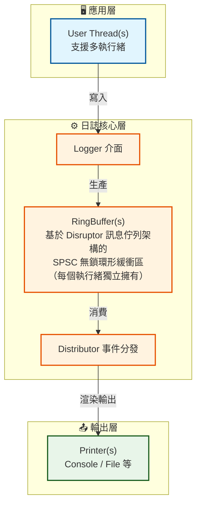
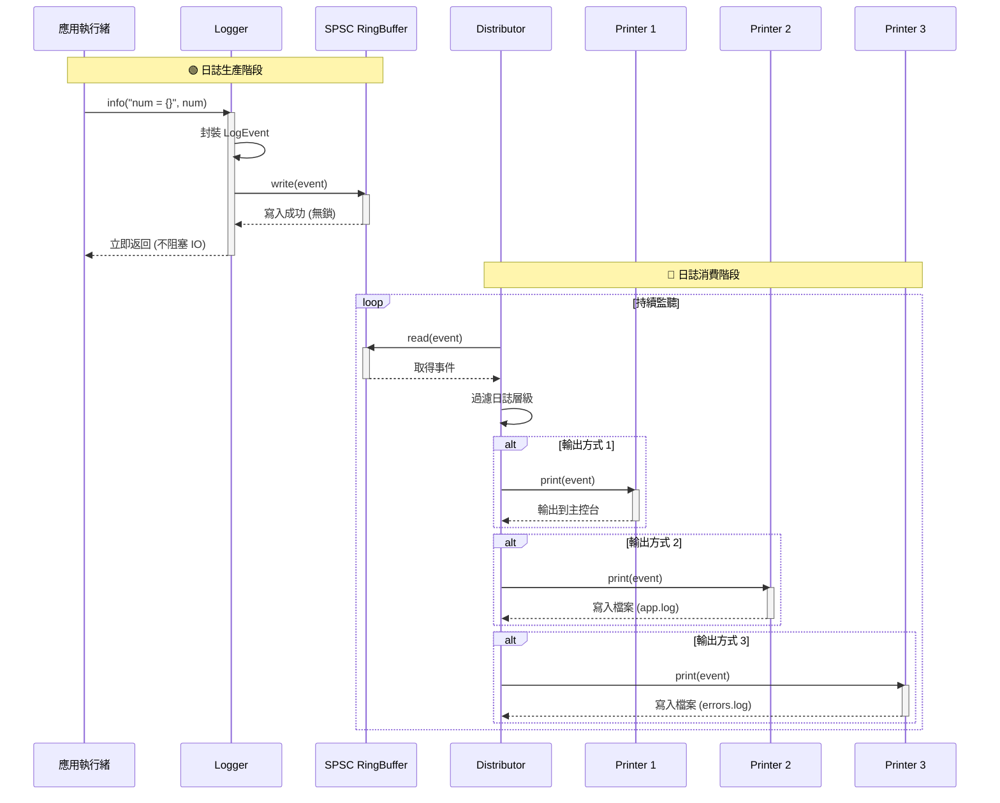

# TinyLogger 開發者文件

**[English](./DEVELOPER.md)** | **[简体中文](./DEVELOPER.zh-Hans.md)** | **[繁體中文](./DEVELOPER.zh-Hant.md)**

> 面向開發者：建置系統、測試規範、架構設計與貢獻指南
> 專案開源位址：[Github: TinyLogger](https://github.com/2059353675/TinyLogger)

## 目錄

- [專案結構](#專案結構)
- [架構設計](#架構設計)
- [建置系統](#建置系統)
    - [CMake 配置](#cmake-配置)
    - [建置指令](#建置指令)
    - [清理建置](#清理建置)
- [測試系統](#測試系統)
    - [測試架構](#測試架構)
    - [執行測試](#執行測試)
    - [編寫測試](#編寫測試)
    - [測試工具函式](#測試工具函式)
- [貢獻指南](#貢獻指南)
- [未來計畫](#未來計畫)

---

## 專案結構

```
TinyLogger/
├── CMakeLists.txt              # 主 CMake 建置檔案
├── include/tiny_logger/        # 標頭檔
│   ├── logger.hpp
│   ├── logger_builder.hpp
│   ├── logger_factory.hpp
│   ├── logger_error.hpp
│   ├── ring_buffer.hpp
│   ├── distributor.hpp
│   ├── printer.hpp
│   ├── printer/
│   │   ├── base.hpp
│   │   ├── console.hpp
│   │   ├── file.hpp
│   │   └── null.hpp
│   ├── types.hpp
│   ├── thread_name.hpp
│   └── ...
├── src/                        # 實作檔
│   ├── logger.cpp
│   ├── logger_builder.cpp
│   ├── logger_factory.cpp
│   ├── ring_buffer.cpp
│   ├── distributor.cpp
│   ├── queue_registry.cpp
│   ├── console.cpp
│   ├── file.cpp
│   ├── null.cpp
│   └── ...
├── test/                       # 測試套件
│   ├── CMakeLists.txt
│   ├── test_common.hpp
│   ├── test_ring_buffer.cpp
│   ├── test_printer.cpp
│   ├── test_distributor.cpp
│   └── test_logger.cpp
├── examples/                  # 範例程式
│   ├── example.cpp
│   └── speed_test.cpp
├── docs/                      # 文件
│   ├── USER_GUIDE.md          # 使用者指南
│   └── DEVELOPER.md          # 開發者文件（本檔案）
└── .clang-format              # 程式碼格式化配置
```

---

## 架構設計

### 核心元件



### 資料流

1. 使用者呼叫 `logger.fatal("嚴重錯誤：系統崩潰，錯誤碼：{}", errorcode);`
2. Logger 將日誌資訊封裝成 `LogEvent`，寫入 `RingBuffer`
3. `Distributor` 執行緒從 `RingBuffer` 讀取事件
4. `Distributor` 根據層級過濾，分發給匹配的 `Printer`
5. `Printer` 格式化日誌資訊，並寫入目標（主控台／檔案），如
    - `[2026-03-21 07:19:25.339158][8343213073192788484][Fatal] 嚴重錯誤：系統崩潰，錯誤碼：57005`

時序圖如下：



### Distributor 喚醒協定

Distributor 閒置等待依 `WaitStrategy`（`BusySpin` / `Yield` / `Sleep` / `Blocking`，預設 `Blocking`）分派。
面向使用者的策略選擇指南在 README 中；本節記錄 `Blocking` 的實作細節。

**邊緣觸發通知（生產者側）：**
- `RingBuffer::enqueue()` 回傳 `EnqueueResult`：溢位時 `Full`；佇列由空轉為非空時 `Success_EmptyToNonEmpty`；其餘為 `Success_NonEmptyToNonEmpty`。
- `Logger::log()` **僅在** `Success_EmptyToNonEmpty` 時呼叫 `Distributor::notify_work()`——持續日誌的常見路徑（佇列本就不為空）**零額外開銷**。
- `notify_work()` 使單調遞增的 `generation_` 計數器自增（release）並喚醒條件變數。

**阻塞等待（消費者側）：**
- 閒置路徑先擷取 `generation_`（acquire），重新整理佇列快照，複查是否有工作，然後阻塞於 `wake_cv_.wait(predicate)`，謂詞為 `generation_ != local || !running_`。
- 該謂詞使遺失/重複喚醒不可能發生：等待前被觀察到的任何生產者 bump 都會被謂詞捕獲；擷取後的 bump 則由「擷取後重新整理快照 + 複查」兜住。
- 快照在**擷取代數之後**（而非之前）重新整理：因為 `register_queue()` 先於生產者的 `enqueue`，而 `enqueue` 又先於可見的 bump，所以擷取後的快照必然包含任何被觀察入隊所屬的佇列。這閉合了「處理中途註冊新佇列導致事件滯留」的競態。
- `stop()` 將 `running_` 設為 `false`，呼叫 `notify_work()`，join 工作執行緒（隨後 drain），最後 flush。

**底層契約：** 繞過 `Logger` 直接對 `RingBuffer` `enqueue` 不會通知 Distributor。在 `Blocking` 下，呼叫者必須在「空→非空」入隊後自行呼叫 `Distributor::notify_work()`，否則事件會滯留。高層 `Logger` 會自動完成此操作。

### 效能測試結果

在 x86_64 主機上量測（`-O3 -march=native`，TSC ≈ 1.87 cycles/ns），開發 `WaitStrategy` 功能時記錄。閒置 CPU 透過單核固定（`taskset -c 0`）閒置 5 秒量測；延遲/吞吐使用 `benchmark` 範例與專用的生產者側微基準。

**閒置 CPU（單核，閒置 5 秒）：**

| 策略       | 閒置 CPU | run() 迴圈次數（2 秒） |
|------------|----------|------------------------|
| `Blocking` | 0%       | ≈ 1（阻塞，無 notify 即不迭代） |
| `Sleep`    | ≈ 1%     | ~2000（1ms 間隔）      |
| `Yield`    | ≈ 93%    | > 1000（忙輪詢）       |
| `BusySpin` | ≈ 93%    | 忙轉                   |

**生產者側 `logger.info()` 延遲（cycles；p50 各策略一致）：**

| 策略       | p50 | p99（單核） | p99（多核） |
|------------|-----|------------|------------|
| `Blocking` | ~67 | ~6900（≈3.7µs futex 喚醒，僅閒置→活躍時每次突發一次） | ~83 |
| `Yield`    | ~68 | ~78        | ~136       |
| `Sleep`    | ~68 | ~84        | ~110       |
| `BusySpin` | ~68 | ~76        | ~377       |

快速路徑（p50 ≈ 67 cycles ≈ 36ns）在四種策略下完全一致。`Blocking` 的 p99 尖峰是閒置→活躍時每次突發第一次入隊付出的一次 futex 喚醒系統呼叫；在持續負載/多核下不出現。

**吞吐（生產者側入隊嘗試，ops/s）：**

| 策略       | 1執行緒(單核) | 8執行緒(單核) | 1執行緒(多核) | 8執行緒(多核) |
|------------|-------------|-------------|-------------|-------------|
| `Blocking` | 11.4M       | 22.2M       | 22.7M       | 37.3M       |
| `Yield`    | 16.2M       | 22.8M       | 12.7M       | 37.2M       |
| `Sleep`    | 26.4M       | 25.5M       | 25.4M       | 42.5M       |
| `BusySpin` | 10.8M       | 21.6M       | 8.2M        | 38.0M       |

**飽和交付率（單核，1 生產者，20 萬條，`Discard`）：**
`Blocking` 實際送達約 2%（約為 `Yield` 的 ~1% 的 1.6–2 倍）：被高效喚醒的消費者比忙輪詢搶 CPU 的消費者更高效。飽和下的高丟棄率是 `Discard` 的固有現象（單核上格式化消費者單條處理比簡單字串生產者慢約 20 倍），並非本次改動引入。

**改動前後對比（單核，舊忙輪詢 `Yield` vs 新預設 `Blocking`）：**

| 指標                 | 舊（busy-poll Yield） | 新（Blocking） |
|----------------------|----------------------|----------------|
| `logger.info()` avg  | 123 cycles           | 67 cycles      |
| `logger.info()` p50  | ~66 cycles           | ~67 cycles     |
| `logger.info()` p99  | ~74 cycles           | ~6900（僅閒置→活躍喚醒） |
| 閒置 CPU             | ~93%                 | 0%             |
| `RingBuffer::enqueue` | ~4.4 cycles          | ~3.8 cycles    |

結論：`Blocking` 預設值將單核閒置 CPU 從 ~93% 降到 0%，且平均延遲反而改善；唯一代價是每次閒置→活躍突發的首次入隊多一次 ~3.7µs 的 futex 喚醒（多核/持續負載下不存在）。若該尖峰不可接受，可改用 `Sleep`（≈1% 閒置 CPU、無喚醒系統呼叫，代價是 ≤ `sleep_interval` 的延遲）。

### 關鍵特性

- **非同步日誌：** 應用執行緒不阻塞（提交日誌僅需約 30 奈秒），日誌輸出由 Distributor 執行緒分發給 Printers 處理
- **無鎖緩衝區：** RingBuffer 為單生產者單消費者（SPSC）佇列，無需鎖，提供了良好的高並發效能
- **RAII 資源管理：** 所有資源（檔案、執行緒）在解構時自動清理
- **執行期唯讀：** Logger 在 init 後進入不可變狀態，所有配置（buffer_size、overflow_policy）不可更改
- **物件不可拷貝：** Logger 禁止拷貝／移動，避免執行緒＋佇列生命週期問題
- **LoggerRef 包裝類別：** 自動管理生命週期；簡化日誌 API；支援拷貝共享底層 Logger；提供空安全

---

## 建置系統

### CMake 配置

專案使用 CMake 3.14+ 建置，主設定檔位於 `CMakeLists.txt`。

**核心配置項目：**

```cmake
# 建置選項
option(TINYLOGGER_BUILD_TESTS "Build tests" ON)
option(TINYLOGGER_BUILD_EXAMPLES "Build examples" ON)

# 依賴查找
find_path(FMT_INCLUDE_DIR NAMES fmt/format.h ...)
find_library(FMT_LIBRARY NAMES fmt ...)
```

### 建置指令

#### 完整建置（推薦）

```bash
cmake -B build -DCMAKE_BUILD_TYPE=Release
cmake --build build
```

#### 選擇性建置

```bash
# 僅建置函式庫（不建置測試和範例）
cmake .. -DTINYLOGGER_BUILD_TESTS=OFF -DTINYLOGGER_BUILD_EXAMPLES=OFF

# 僅建置測試
cmake .. -DTINYLOGGER_BUILD_EXAMPLES=OFF

# 僅建置範例
cmake .. -DTINYLOGGER_BUILD_TESTS=OFF
```

#### 執行測試

```bash
# 方式 1：使用 cmake 目標
cmake --build build --target run_tests

# 方式 2：使用 CTest
ctest --output-on-failure
```

#### 安裝

```bash
cmake --install build  # 預設安裝到 /usr/local

# 自訂安裝路徑
cmake -B build -DCMAKE_INSTALL_PREFIX=/opt/tinylogger
cmake --install build
```

### 清理建置

```bash
# 標準清理（僅清理建置產物）
cmake --build build --target clean

# 完整清理（建置產物 + 測試暫存檔 + 範例產物）
cmake --build build --target clean-all
```

`clean-all` 目標會清理：

- CMake/Make 建置產物
- 測試產生的暫存檔（`test_temp_*.json`、`test_*.log`）
- 範例產生的日誌檔（`examples/*.log`）

---

## 測試系統

### 測試架構

TinyLogger 使用**自訂測試框架**（不依賴外部測試函式庫），包含 5 個測試套件：

| 測試檔案                   | 測試類型 | 測試數量 | 覆蓋模組                 |
|------------------------|------|------|----------------------|
| `test_ring_buffer.cpp` | 單元測試 | 11   | 環形緩衝區                |
| `test_printer.cpp`     | 單元測試 | 13   | Console/File Printer |
| `test_distributor.cpp` | 單元測試 | 13   | 事件分發器                |
| `test_logger.cpp`      | 整合測試 | 11   | Logger 完整流程          |

**總計：51 個測試案例**

### 執行測試

```bash
cd build
ctest --output-on-failure
```

### 編寫測試

#### 測試檔案結構

每個測試檔案遵循以下結構：

```cpp
#include <tiny_logger/xxx.hpp>
#include "test_common.hpp"

using namespace tiny_logger;
using namespace tiny_logger::test;

// ==================== 測試函式 ====================

bool test_xxx_feature() {
    // 測試邏輯
    return true; // 通過
    // return false; // 失敗
}

// ==================== 主函式 ====================

int main() {
    std::cout << "========================================" << std::endl;
    std::cout << "  XXX Test Suite" << std::endl;
    std::cout << "========================================" << std::endl;

    TestResult result;

    run_test("Feature 1", test_xxx_feature_1, result);
    run_test("Feature 2", test_xxx_feature_2, result);
    
    print_test_summary("XXX Test Suite", result);
    return result.failed > 0 ? 1 : 0;
}
```

#### 測試函式規範

**要求：**

1. 測試函式回傳 `bool`（`true` = 通過，`false` = 失敗）
2. **不在測試函式內印出 `[TEST]` 或 `PASSED/FAILED`**（由框架統一處理）
3. 使用 `test_common.hpp` 提供的工具函式
4. 暫存檔使用 RAII 類別（自動清理）

**建議：**

- 測試函式命名：`test_模組_功能`，如 `test_ring_buffer_creation`
- 使用簡潔的斷言邏輯，直接回傳布林表達式
- 並發測試使用適當的等待和同步機制

### 測試工具函式

`test/test_common.hpp` 提供以下工具：

#### `create_test_event()`

建立測試用 `LogEvent`：

```cpp
// 版本 1：回傳 LogEvent（適用於 distributor、printer 測試）
LogEvent event = create_test_event(LogLevel::Info, "Test message");

// 版本 2：透過參考指派，回傳 bool（適用於 ring_buffer 測試）
LogEvent event;
bool ok = create_test_event(event, LogLevel::Info, "Test message");
```

#### `TempLogFile` - 暫存日誌檔

RAII 風格，提供內容讀取：

```cpp
{
    TempLogFile log("output.log");
    
    // 使用 log.path() 作為日誌輸出路徑
    Logger logger;
    logger.init(create_file_config(log.path()));
    logger.info("Test");
    
    // 讀取內容驗證
    std::string content = log.read_content();
    assert(content.find("Test") != std::string::npos);
} // 檔案自動刪除
```

#### `run_test()` - 測試執行器

統一執行、捕捉例外、統計結果：

```cpp
TestResult result;
run_test("Test name", test_function, result);
```

#### `print_test_summary()` - 結果輸出

印出格式化的測試結果：

```cpp
print_test_summary("Suite Name", result);
// 輸出：
// ========================================
//   Suite Name
//   Results: 10 passed, 0 failed
// ========================================
```

---

## 貢獻指南

### 命名約定

| 類型    | 規範               | 範例                                 |
|-------|------------------|------------------------------------|
| 類別名稱  | PascalCase       | `RingBuffer`, `ConsolePrinter`     |
| 函式／方法 | snake_case       | `create_test_event`, `should_log`  |
| 變數    | snake_case       | `buffer_size`, `min_level`         |
| 常數    | UPPER_SNAKE_CASE | `LOG_MSG_SIZE`, `MAX_PRINTERS`     |
| 命名空間  | snake_case       | `tiny_logger`, `tiny_logger::test` |

### 程式碼風格

- **換行、空白等：** 由 `.clang-format` 自動配置
- **標頭檔保護：** `#pragma once` 風格
- **註解：** Doxygen 風格；關鍵邏輯必須註解

### 提交規範

提交訊息格式：

```
<type>: <subject>

<body>  # 可選
```

**Type 列表：**

- `feat`：新功能
- `fix`：修復 bug
- `docs`：文件更新
- `refactor`：程式碼重構
- `test`：測試相關
- `chore`：建置／工具鏈變更

---

## 未來計畫

字母越前，重要性越高，即 A 最優先，以此類推。

### 增加序列埠列印（C）

支援 RS-232、RS-485/RS-422、UART 等序列埠通訊方式

### 自訂日誌輸出格式化（D）

目前，每個 printer 的格式化方法都被硬編碼進 `printer_xxx.hpp`，未來可以支援在設定檔中增加可選的自訂 pattern（類似 spdlog
%Y-%m-%d [%l] %v）

### 依賴管理（D）

計畫支援以下套件管理器：

- **vcpkg：** 新增 `vcpkg.json`
- **Conan：** 新增 `conanfile.txt`